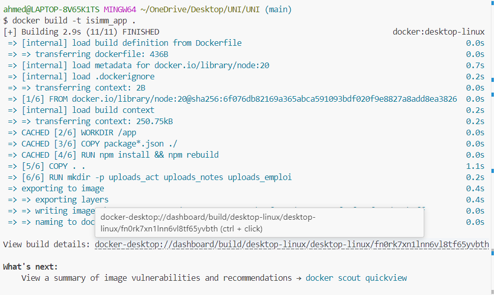
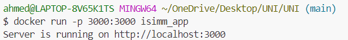
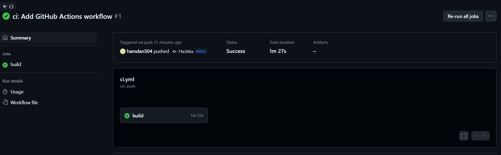
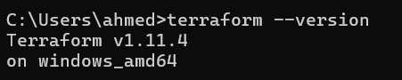
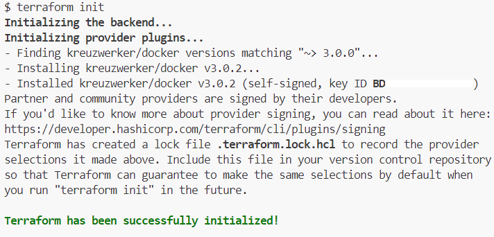
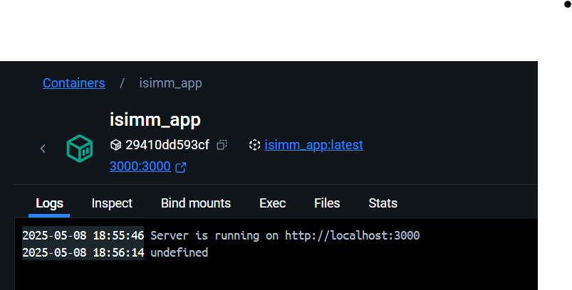

# 🚀 UNI - Web Application with CI/CD Pipeline

[](https://github.com/hamdan504/UNI/actions)

> A modern university website implementation with automated deployment pipeline

## 1. Set Up Version Control

The project is already under version control and hosted on GitHub.  
**Repository URL**: `https://github.com/hamdan504/UNI.git`

## 2. Develop a Simple Web Application

Our project is a web application inspired by our university website, featuring improvements in both design and architecture.

### Here is the app running locally:


## 3. Containerize the Application

We containerized the application using Docker to ensure consistent deployment across environments.

### Docker Implementation
* **Docker Build Command**
  ```bash
  docker build -t uni-app .
  ```

* **Docker Run Command**
  ```bash
  docker run -p 3000:3000 uni-app
  ```

### Docker Build


### Docker Build Success


### Docker Run



## 4. Set Up Continuous Integration

### Git Commit and Push: GitHub Actions Workflow Setup

Below is a sample terminal session demonstrating how we staged, committed, and pushed files to configure a CI workflow using GitHub Actions:

```bash
# Stage GitHub workflow directory
$ git add .github/

# Stage the environment file
$ git add .env.example

# Stage package.json
$ git add package.json

# Commit with a conventional commit message
$ git commit -m "ci: Add GitHub Actions workflow"
[main 74a366a] ci: Add GitHub Actions workflow
 4 files changed, 57 insertions(+), 1 deletion(-)
 create mode 100644 .env.example
 create mode 100644 .github/workflows/.env.example
 create mode 100644 .github/workflows/ci.yml

# Push changes to GitHub
$ git push origin main
Enumerating objects: 9, done.
Counting objects: 100% (9/9), done.
Delta compression using up to 12 threads
Compressing objects: 100% (6/6), done.
Writing objects: 100% (7/7), 1.15 KiB | 1.15 MiB/s, done.
Total 7 (delta 2), reused 0 (delta 0), pack-reused 0
remote: Resolving deltas: 100% (2/2), completed with 2 local objects.
To https://github.com/hamdan504/UNI.git
   37e2016..74a366a  main -> main
```



## 5. Continuous Deployment

Our CD pipeline automatically deploys the application when changes are pushed to the main branch and CI checks pass.

### Deployment Process


## Infrastructure as Code with Terraform

- download from https://developer.hashicorp.com/terraform/install#windows
- extract and add the extracted file to path in evironment variables
- test : 




How to Run the UNI Docker Container on Another Machine 
Prerequisites
Docker installed on the machine
Git installed on the machine
Step-by-Step Guide

1. Clone the Repository
git clone https://github.com/hamdan504/UNI.git
cd UNI

2. Build and Run the Container
# Build the Docker image
docker build -t uni-app .

# Run the container
docker run -d -p 3000:3000 --name uni-app uni-app

# Test the app on the browser
http://localhost:3000/
